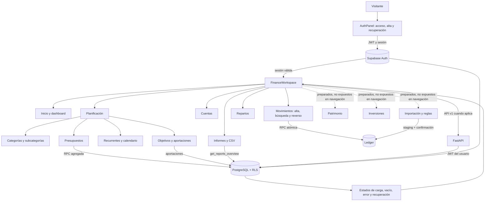

# Flujo de aplicación — Aplicación Financiera

Actualizado: 2026-09-08 · Fuente: código y migraciones locales · Leyenda: `VERIFICADO` = comprobación ejecutada en este cierre; `INFERIDO` = revisado en código; `BLOQUEADO` = requiere entorno o acción externa.

## Límites y recuperación

- `VERIFICADO`: pantalla de acceso, servidor Vite y health de FastAPI en localhost; no hay errores ni avisos de consola en la pantalla pública.
- `INFERIDO`: las operaciones financieras críticas se dirigen a RPC y las consultas a funciones `SECURITY INVOKER` según las migraciones locales.
- `BLOQUEADO`: los flujos autenticados, la persistencia y el aislamiento entre dos usuarios no pueden declararse verificados sin una sesión de prueba y un Supabase con las migraciones actuales aplicadas.

